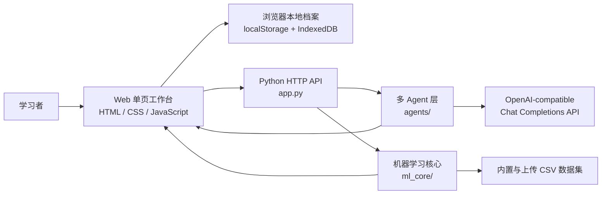

# 基于多 Agent 协作的机器学习技术导师型学习辅助系统

<p align="center">
  <strong>一个面向机器学习初学者的导师型学习工作台，把学习规划、概念讲解、算法可视化、代码陪练、实验训练、错误诊断和学习复盘串成完整闭环。</strong>
</p>

<p align="center">
  <a href="#快速开始"></a>
  <a href="#技术栈"></a>
  <a href="#项目架构"></a>
  <a href="#大模型-api-配置"></a>
  <a href="#测试"></a>
</p>


## 项目简介

机器学习课程的难点往往不只是某个公式，而是概念、代码、实验、指标和排错之间的断裂。本项目围绕“目标输入 -> 路线规划 -> 概念讲解 -> 算法观察 -> 代码复现 -> 实验训练 -> 结果解释 -> 错误诊断 -> 学习复盘”设计了一套多 Agent 协作式学习系统。

系统采用轻量级 Web 单页工作台作为入口，后端使用 Python 标准库 `http.server` 提供接口服务，前端使用原生 HTML/CSS/JavaScript 实现交互、Canvas 算法可视化和本地学习档案。大模型能力通过 OpenAI-compatible Chat Completions 接口接入，用户可以在页面中统一配置，也可以为不同 Agent 单独配置模型。

## 核心亮点

- 多 Agent 教学闭环：学习规划、概念导师、算法可视化、代码陪练、结果解释、错误诊断、测评诊断、总结复习和开放问答分工协作。
- 本地可复现实验：训练、预测、指标和混淆矩阵由本地 Python 代码计算，大模型只负责解释和辅导，避免“编造实验结果”。
- 无数据库学习档案：使用 `localStorage` 与 `IndexedDB` 保存学习路线、实验、诊断、薄弱点、测评和复习记录。
- Canvas 算法可视化：支持 K-means、KNN、线性回归和决策树分步演示，帮助学生观察算法内部过程。
- 标准库优先：后端服务与机器学习核心不依赖第三方包，适合课程设计展示、快速运行和二次开发。
- GitHub 友好：项目包含截图、论文材料、单元测试与契约测试，便于展示完整工程工作量。

## 功能总览

| 模块 | 能力 |
| --- | --- |
| 首页工作台 | 展示学习进度、模型接口状态、学习档案统计和多 Agent 协作入口 |
| API 设置 | 支持统一配置或分 Agent 配置 OpenAI-compatible 接口，并提供连接测试 |
| 学习规划 | 根据基础水平、学习目标、学习重点、节奏和薄弱点生成阶段化学习路线 |
| 概念学习 | 输出通俗解释、技术定义、公式规则、代码联系、常见误区、自测题和下一步主题 |
| 算法可视化 | 用 Canvas 分步展示 K-means、KNN、线性回归、决策树，并可请求 Agent 解释 |
| 代码陪练 | 按机器学习流程生成代码、逐行解释、运行检查清单和常见错误提醒 |
| 实验中心 | 支持示例 CSV、上传 CSV、粘贴 CSV、数据体检、模型训练、指标展示和报告导出 |
| 错误诊断 | 根据问题场景、报错信息和代码片段输出根因、修复代码、排查步骤和预防清单 |
| 学习档案 | 保存、搜索、筛选、查看、导入和导出本地学习记录 |
| 开放问答 | 在任意页面携带当前学习上下文向大模型提问 |


## 项目架构



系统主要分为五层：

- 前端工作台：`templates/index.html`、`static/css/style.css`、`static/js/app.js` 负责页面组织、Hash 路由、表单交互、Canvas 绘图和结果渲染。
- 本地档案层：`static/js/storage.js` 使用 IndexedDB 保存学习记录，使用 localStorage 保存当前学习状态和 API 设置。
- 后端接口层：`app.py` 使用 `ThreadingHTTPServer` 提供静态资源、样例数据、Agent 调用和模型训练接口。
- 多 Agent 层：`agents/` 按教学角色拆分，负责结构化生成学习规划、概念解释、代码指导、诊断和复习建议。
- 机器学习核心：`ml_core/` 负责 CSV 解析、数据体检、特征提取、模型训练、预测和指标计算。

## Agent 分工

| Agent | 作用 |
| --- | --- |
| 学习规划 Agent | 生成符合机器学习先修顺序的阶段路线 |
| 概念导师 Agent | 将概念拆成解释、公式、示例、误区、练习和自测 |
| 算法可视化 Agent | 结合当前画布状态解释算法步骤和观察重点 |
| 代码陪练 Agent | 生成机器学习流程代码、逐行解释和检查清单 |
| 结果解释 Agent | 解释 Accuracy、Precision、Recall、F1、混淆矩阵等实验结果 |
| 错误诊断 Agent | 分析报错、异常结果和代码问题，给出修复与验证步骤 |
| 测评诊断 Agent | 根据练习、测评、实验和诊断记录识别薄弱点 |
| 总结复习 Agent | 读取学习档案，生成阶段复盘和下一步复习建议 |
| 开放问答 Agent | 根据当前页面上下文回答临时问题，并可自动分配到合适角色 |

## 机器学习实验能力

实验中心支持四类分类模型：

- `nearest_centroid`：最近质心分类器
- `knn`：KNN 分类器
- `decision_tree`：简化决策树
- `gaussian_nb`：高斯朴素贝叶斯

训练流程包含：

- CSV 解析与目标列检查
- 数值特征识别
- 缺失值统计与均值填补
- 重复行统计
- 按类别分层的 70/30 训练测试划分
- 距离模型 z-score 标准化
- Accuracy、宏平均 Precision、Recall、F1
- 各类别指标、混淆矩阵和样本预测对照

内置示例数据集：

- Iris 鸢尾花三分类
- Palmer Penguins 企鹅物种分类
- Wine 葡萄酒品种识别
- Breast Cancer 肿瘤良恶性判别
- Titanic 泰坦尼克生还预测

## 技术栈

| 方向 | 技术 |
| --- | --- |
| 后端服务 | Python 标准库 `http.server`、`ThreadingHTTPServer` |
| 大模型接入 | OpenAI-compatible Chat Completions API |
| 前端 | HTML、CSS、Vanilla JavaScript |
| 可视化 | Canvas |
| 本地存储 | localStorage、IndexedDB |
| 机器学习核心 | Python 标准库实现 CSV 解析、分类器和指标计算 |
| 测试 | Python `unittest` |

## 快速开始

### 1. 准备环境

请确保本机已安装 Python 3.10 或更高版本。

```powershell
python --version
```

本项目当前不需要安装第三方依赖。进入项目根目录后，直接运行：

```powershell
python app.py
```

启动成功后，终端会输出：

```text
Demo server running at http://127.0.0.1:8000
```

然后在浏览器打开：

```text
http://127.0.0.1:8000
```

### 2. 体验本地实验

即使还没有配置大模型接口，也可以先使用实验中心：

1. 进入“实验中心”。
2. 选择内置示例数据集，例如 Iris 鸢尾花三分类。
3. 点击“载入所选案例”。
4. 确认目标列为 `target`。
5. 选择模型并训练。
6. 查看指标、混淆矩阵、样本预测和可复现实验代码。

### 3. 配置大模型 Agent

进入页面顶部的“API 设置”，填写接口地址、模型名称和 API Key。

支持的地址形式：

```text
https://api.openai.com/v1
https://你的服务地址/v1
https://你的服务地址/v1/chat/completions
http://127.0.0.1:11434/v1
```

配置方式：

- 统一配置：所有 Agent 使用同一套模型接口。
- 分 Agent 配置：为学习规划、概念导师、代码陪练、结果解释等角色分别设置模型。
- 快捷复制：先填写统一接口，再复制到全部 Agent 后微调。

注意：API Key 保存在浏览器 localStorage 中，后端只在当前请求中使用，不会长期写入服务端文件或数据库。

## 推荐使用流程

1. 在“API 设置”中配置模型接口，并测试连接。
2. 在“学习规划”中输入学习目标、基础水平、学习重点和节奏，生成学习路线。
3. 点击当前阶段，进入“概念学习”理解术语、公式和常见误区。
4. 使用“算法可视化”观察 K-means、KNN、线性回归或决策树的分步过程。
5. 在“代码陪练”中生成对应流程代码，并阅读逐行解释和检查清单。
6. 在“实验中心”载入示例或自己的 CSV，完成训练和指标分析。
7. 如果遇到报错或结果异常，进入“错误诊断”生成修复建议。
8. 将概念、代码、实验和诊断结果保存到“学习档案”，再由总结复习 Agent 生成复盘建议。

## 常用 API

| 方法 | 路由 | 说明 |
| --- | --- | --- |
| `GET` | `/` | 返回主页面 |
| `GET` | `/api/concepts` | 获取概念列表 |
| `GET` | `/api/sample_datasets` | 获取示例数据集元信息 |
| `GET` | `/api/sample_dataset?id=iris` | 获取指定示例数据集 |
| `POST` | `/api/test_llm` | 测试大模型接口连通性 |
| `POST` | `/api/learning_plan` | 生成学习规划 |
| `POST` | `/api/concept_explain` | 生成概念解释 |
| `POST` | `/api/code_tutor` | 生成代码陪练内容 |
| `POST` | `/api/visual_explain` | 生成算法可视化解释 |
| `POST` | `/api/train_model` | 执行本地分类模型训练 |
| `POST` | `/api/explain_result` | 解释训练结果 |
| `POST` | `/api/error_diagnose` | 生成错误诊断 |
| `POST` | `/api/assessment_diagnose` | 生成测评诊断 |
| `POST` | `/api/review_summary` | 生成复习总结 |
| `POST` | `/api/open_question` | 开放问答 |

## 目录结构

```text
.
├── app.py                         # 后端入口与 API 路由
├── config.py                      # 应用名称、地址和端口配置
├── llm_client.py                  # Chat Completions 兼容客户端
├── agents/                        # 多 Agent 实现
│   ├── planner_agent.py
│   ├── concept_agent.py
│   ├── visual_agent.py
│   ├── code_tutor_agent.py
│   ├── result_agent.py
│   ├── error_agent.py
│   ├── assessment_agent.py
│   ├── review_agent.py
│   └── qa_agent.py
├── ml_core/                       # 机器学习核心逻辑
│   ├── data_processor.py
│   ├── model_trainer.py
│   └── sample_datasets.py
├── templates/
│   └── index.html                 # 单页应用结构
├── static/
│   ├── css/style.css              # 视觉样式
│   └── js/
│       ├── app.js                 # 主交互逻辑、页面渲染、Canvas 可视化
│       └── storage.js             # localStorage 与 IndexedDB 封装
├── data/
│   └── sample_iris.csv            # 示例数据
├── tests/                         # 单元测试与契约测试
├── web/                           # README 与论文使用的页面截图
└── 课程论文LaTeX_20260706/          # 课程论文与架构图素材
```

## 测试

运行全部测试：

```powershell
python -m unittest discover -s tests
```

运行单个测试文件：

```powershell
python -m unittest tests.test_stability
```

测试覆盖内容包括后端稳定性、大模型客户端错误处理、前端契约、实验训练逻辑、算法可视化契约和工具脚本安全性。

## 开发说明

- 后端端口在 `config.py` 中配置，默认是 `127.0.0.1:8000`。
- 新增 Agent 时，建议在 `agents/` 中单独建文件，并在 `app.py` 与前端 `AGENTS` 列表中注册。
- 新增实验模型时，优先扩展 `ml_core/model_trainer.py` 的 `SUPPORTED_MODELS` 与训练分支。
- 新增页面记录类型时，需要同步扩展 `static/js/storage.js` 的 IndexedDB store 和前端档案渲染逻辑。
- 生产部署前建议迁移到 FastAPI 或 Flask，增加鉴权、密钥管理、日志和服务端持久化。

## 隐私与安全

- 学习档案默认只保存在当前浏览器，不会自动上传到服务端。
- API Key 保存在浏览器 localStorage，适合本地课程演示和个人学习，不建议直接用于公共多用户生产环境。
- 后端不会长期保存用户的 API Key、学习记录或上传数据。
- 如果要部署到公网，请加入用户认证、HTTPS、服务端密钥代理和请求限流。


